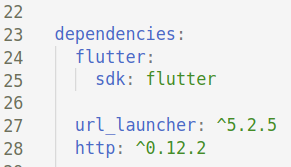

# FLUTTER

As a mobile app developer, develop a simple Flutter app that accepts a user input and displays a summary of keywords used by various users, so that users can suggest what technologies do they find interesting.

## General Commands

1. `flutter precache`
2. `flutter doctor`
3. `flutter devices`
4. `flutter pub get`

## API Request

1. In `pubspec.yaml` file, add dependencies 
   1. `http: ^0.12.2`
   2. `url_launcher: ^5.2.5`
   
   

2. Create a class `MyKeyword` that will contain data from network request

        class MyKeyword {
            final int id;
            final String title;

            MyKeyword({this.id, this.title});

            factory MyKeyword.fromJson(Map<String, dynamic> json) {
                return MyKeyword(
                    id: json['id'],
                    keyword: json['title'],
                );
            }
        }

3. Make API calls and convert response body into JSON Map

        Future<MyKeyword> addKeyword(String title) async {
            final http.Response response = await http.post(
                'https://127.0.0.1/words',
                headers: <String, String>{
                    'Content-Type': 'application/json; charset=UTF-8',
                },
                body: jsonEncode(<String, String>{
                    'title': title,
                }),
            );

            if (response.statusCode == 201) {
                return MyKeyword.fromJson(json.decode(response.body));
            } else {
                throw Exception('Failed to add keyword.');
            }
        }

4. Create a stateful widget and update the content of `build()` method

    ```bash
    class MyApp extends StatefulWidget {
        MyApp({Key key}) : super(key: key);

        @override
        _MyAppState createState() {
            return _MyAppState();
        }
    }

    class _MyAppState extends State<MyApp> {
        final TextEditingController _controller = TextEditingController();
        Future<Album> _futureAlbum;

        @override
        Widget build(BuildContext context) {
            return MaterialApp(
                ...
            );
        }
    }
    ```

5. Return a material app with desired UI components


6. Define functions 


        _launchURL() async {
            const url = 'https://null.co.in';
            if (await canLaunch(url)) {
                await launch(url);
            } else {
                throw 'Could not launch $url';
            }
        }

7. Invoke function calls

        RaisedButton(
            onPressed: _launchURL,
            child: Text('View Top Keywords'),
        ),

## An Example - "null" Android App

Follow the steps mentioned  [here](nullMobileApp/README.md) to see how easily we can create a Flutter project and load an entire website inside the webview of an Android app. 